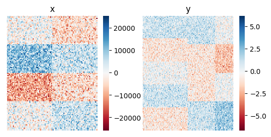
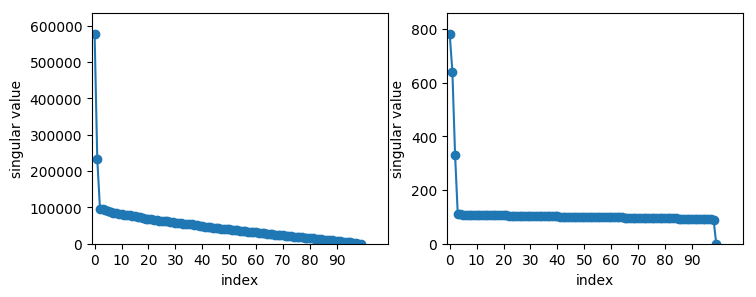
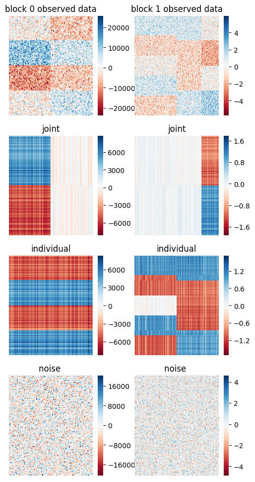
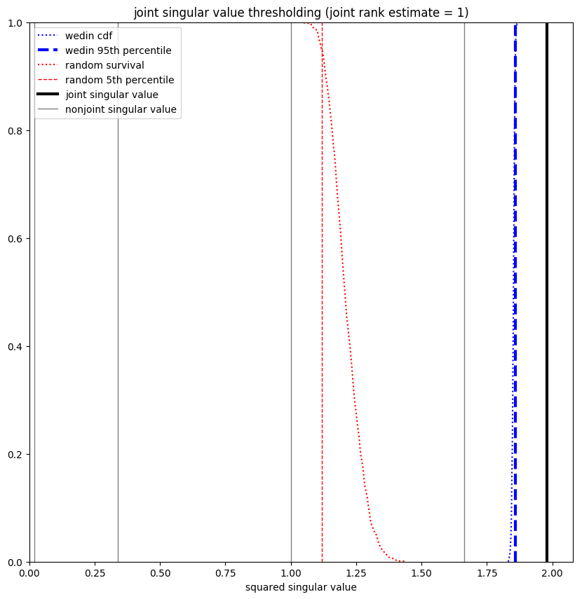

jive
----

**author**: `Iain Carmichael`_

Additional documentation, examples and code revisions are coming soon.
For questions, issues or feature requests please reach out to Iain:
iain@unc.edu.

Overview
========

**jive** is a data analysis package for high-dimensional, multi-block
(or multi-view) data. The multi-block data setting mean two or more data
matrices with a fixed set of observations (e.g. patients) and multiple
sets of features (e.g. clinical features and gene expression data).

The primary algorithm in this package is Angle based Joint and
Individual Variation Explained (AJIVE) which is a data integration/feature
extraction algorithm. AJIVE finds joint modes of variation which are
common to all K data blocks as well as modes of *individual* variation which
are specific to each block. For a detailed discussion of AJIVE see
`Angle-Based Joint and Individual Variation Explained`_. An R version of
AJIVE can be found `here`_.

Installation
============
To install use pip:

::

    pip install jive

Or clone the repo:

::

    git clone https://github.com/idc9/py_jive.git
    python setup.py install

Example
=======

.. code:: python

    from jive.AJIVE import AJIVE
    from jive.PCA import PCA
    from jive.ajive_fig2 import generate_data_ajive_fig2
    from jive.viz.block_visualization import data_block_heatmaps, jive_full_estimate_heatmaps
    import matplotlib.pyplot as plt
    # %matplotlib inline

    X, Y = generate_data_ajive_fig2()
    data_block_heatmaps([X, Y])

.. code:: python

    # determine initial signal ranks by inspecting scree plots
    plt.figure(figsize=[10, 5])
    plt.subplot(1, 2, 1)
    PCA().fit(X).plot_scree()
    plt.subplot(1, 2, 2)
    PCA().fit(Y).plot_scree()

.. code:: python

    ajive = AJIVE(init_signal_ranks={'x': 2, 'y': 3})
    ajive.fit(blocks={'x': X, 'y': Y})

    plt.figure(figsize=[10, 20])
    jive_full_estimate_heatmaps(ajive.get_full_block_estimates(),
                                blocks={'x': X, 'y': Y})

.. code:: python

    ajive.plot_joint_diagnostic()

Help and Support
================

Additional documentation, examples and code revisions are coming soon.
For questions, issues or feature requests please reach out to Iain:
iain@unc.edu.

Documentation
^^^^^^^^^^^^^

The source code is located on github:
`https://github.com/idc9/py\_jive`_. Currently the best math reference
is the `AJIVE paper`_.

Testing
^^^^^^^

Testing is done using `nose`_.

Contributing
^^^^^^^^^^^^

We welcome contributions to make this a stronger package: data examples,
bug fixes, spelling errors, new features, etc.

Citation
^^^^^^^^

A `Journal of Statistical Software`_ paper is coming soon.

.. _Iain Carmichael: https://idc9.github.io/
.. _Angle-Based Joint and Individual Variation Explained: https://arxiv.org/pdf/1704.02060.pdf
.. _here: https://github.com/idc9/r_jive
.. _these example notebooks: doc/example_notebooks/
.. _`https://github.com/idc9/py\_jive`: https://github.com/idc9/r_jive
.. _AJIVE paper: https://arxiv.org/pdf/1704.02060.pdf
.. _nose: http://nose.readthedocs.io/en/latest/
.. _Journal of Statistical Software: https://www.jstatsoft.org/index
